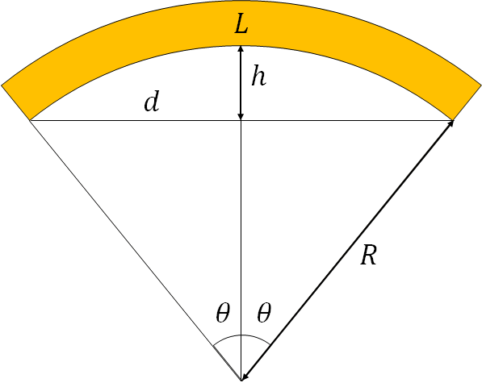

# stoney_equation
Calculate radius of curvature and residual stress of thin film using stoney's equation

Residual strain of thin film which is deposited on substrate is one of the most interesting properties.
However, it is difficult to measure directly and we evaluate from radius curvature.
This program can help you to calcurate.

# Calcurate radius of curvature
At first, we calcurate radius of curvature.  
Fig. 1 shows the parameters of this calcuration.  
We use 5 parameters;

L: diameter of substrate  
d: length of chord  
h: height  
R: radius of curvature  
Θ: angle  

Ver 1.0  
We need exact data of L and h for calcurate.
I hope you probably know the both parameter when you want to calcurate residual strain.

